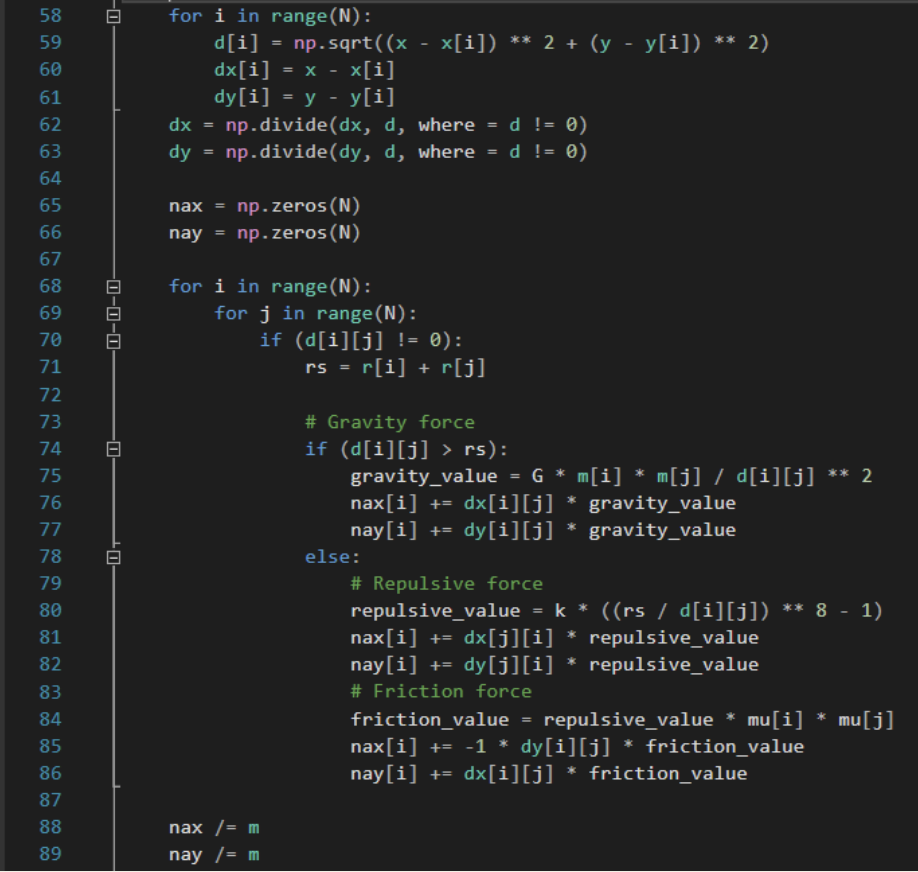
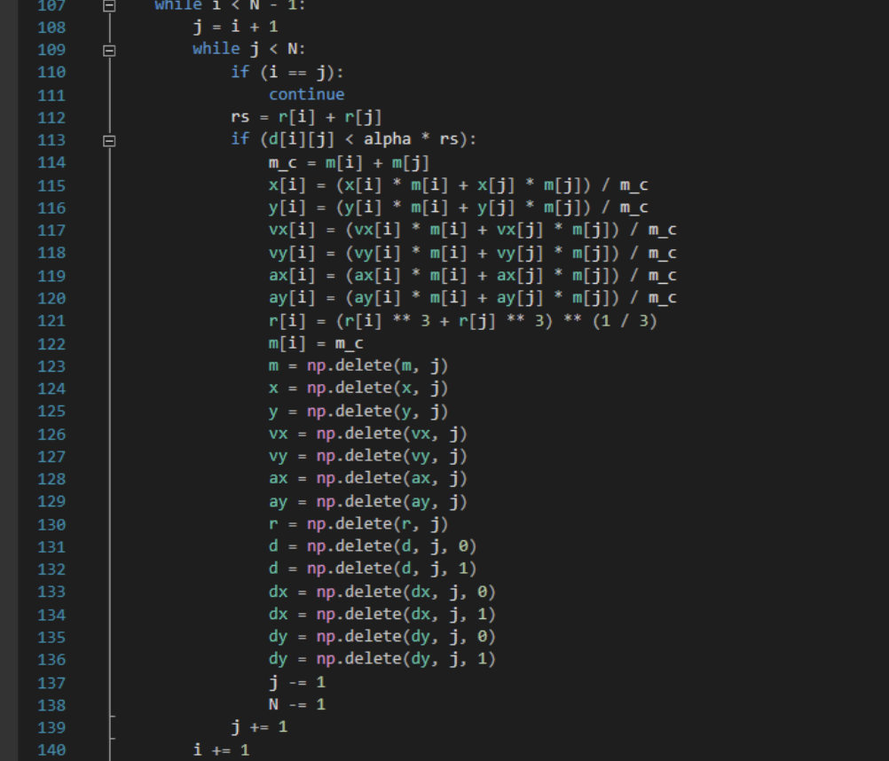
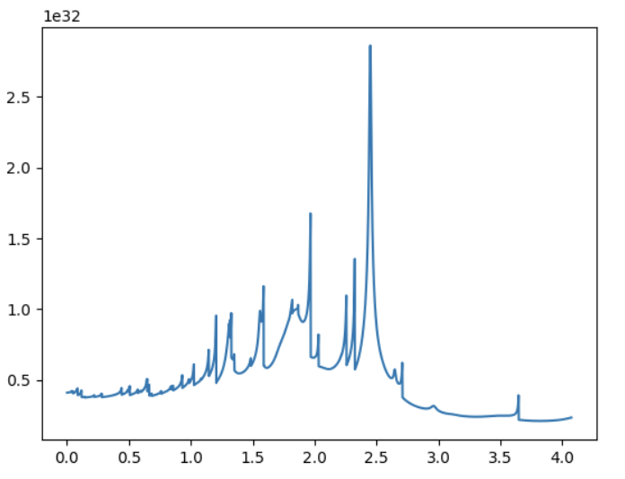

---
# Front matter
lang: ru-RU
title: "Отчёт по четвертому этапу группового проекта"
subtitle: "Образование планетной системы"
author: "Абакумов Егор, Сухарев Кирилл, Калинина Кристина, Еременко Артем"

# Formatting
toc: false
slide_level: 2
theme: metropolis
header-includes: 
 - \metroset{progressbar=frametitle,sectionpage=progressbar,numbering=fraction}
 - '\makeatletter'
 - '\beamer@ignorenonframefalse'
 - '\makeatother'
aspectratio: 43
section-titles: true
---

# Цели

## Цель работы

Провести моделирование одного из этапов эволюции Вселенной - образование некой «солнечной» 
системы из межзвездного газа.

## Цель этапа

 Провести коллективное обсуждение результата проекта, подвести итоги работы, сделать выводы.

# Теоретическое обоснование

## Определение значимых для модели свойств объекта

Для всестороннего моделирования планетарной системы нами были выбраны следующие характеристики:

- Положение тел в пространстве

- Масса

- Радиусы

- Скорость

- Ускорение

- Потенциальная энергия

## Механизмы взаимодействия

Движение частиц будет вычисляться согласно II закону Ньютона:

$$F_i = m_i \frac{d^2 r_i}{dt^2}$$ 

Потенциальное энергия взаимодействия частицы со всеми остальными описывается следующим уравнением:

$$U_i=\sum_{i\neq j}\frac{\gamma m_j m_i}{r_{ij}}$$

## Механизмы взаимодействия

Сила отталкивания между двумя частицами равна:

$$F^r(b) = k((\frac{a}{b})^8 - 1)$$

А сила трения вычисляется по формуле:

$$F^f = \mu_1\mu_2 F^r(b)$$

## Построение алгоритма

По сути алгоритм сошелся к нахождению векторной суммы всех сил, действующих на частицу, а затем к просчету ее новых координат согласно следующим законам движения:

- Координаты:

$$x_{n+1} = x_n + v_n dt + \frac {a_n dt^2}{2}$$

- Скорости:

$$ v_{n+1} = v_n + \frac {a_{n + 1} + a_n}{2} dt $$

## Построение алгоритма

Также необходимо учитывать, что при сильном сближении частицы слипаются. Их параметры в таком случае примут следующий вид.

$$ r = \frac {m_i r_i + m_j r_j}{ m_i + m_j } $$

$$ v = \frac {m_i v_i + m_j v_j}{ m_i + m_j } $$

$$ R = \sqrt[3]{R_i^3 + R_j^3} $$

# Программная реализация

## Нахождение векторной суммы всех сил

{ #fig:001 width=75% } 

## Слипание частиц

{ #fig:002 width=75% }

## График потенциальной энергии

{ #fig:003 width=95% }

## Графическое моделирование

{ #fig:004 width=75% }

## Графическое моделирование

{ #fig:005 width=75% }

## Графическое моделирование

{ #fig:006 width=75% }

# Выводы

В ходе работы была разработана и реализована в программном коде модель некой «солнечной» системы из межзвездного газа. Проведены все математические расчеты и подготовлено теоретическое обоснование. 

## Оценка модели. Плюсы

- Модель получилась объемной, охватывающей множество частиц

- Модель учитывает воздействие на частицы всех значимых сил

- Модель предусматривает слипание частиц и их отталкивание

- Модель соотносится с реальными условиями, частицы ведут себя естественно

## Оценка модели. Минусы

- Из-за значительной вычислительной сложности пришлось ограничить масштабы модели несколькими сотнями частиц

- Модель двумерна

- Константы и коэффициенты взаимодействия некоторых частиц не всегда соотносятся с реальными, так как размер частицы на экране технически ограничен количеством пикселей, невозможно подобрать действительные коэффициенты

## Самооценка

Свою работу наша группа оценивает положительно, так как все основные аспекты моделируемого объекта были учтены, необходимые практические результаты были получены и продемонстрированы. Работа была тщательно проанализирована, ошибки учтены и исправлены, выводы по результатам сделаны, а оставшиеся недостатки обусловлены лишь техническими ограничениями.