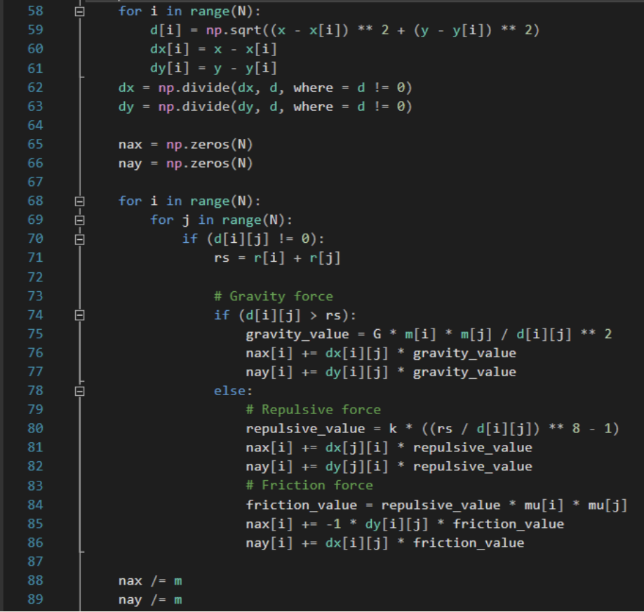
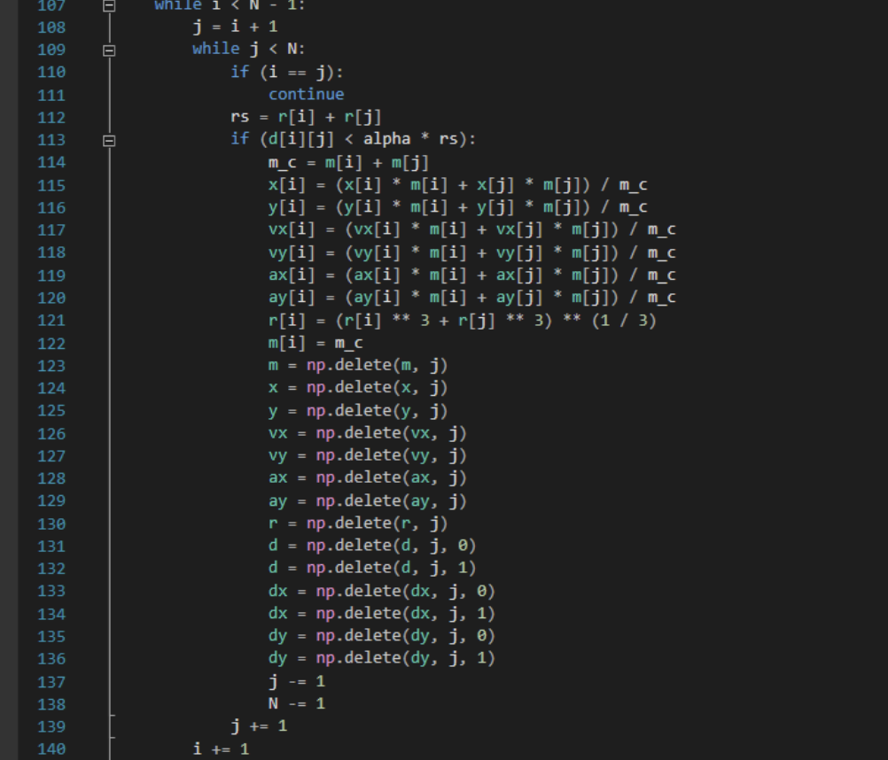
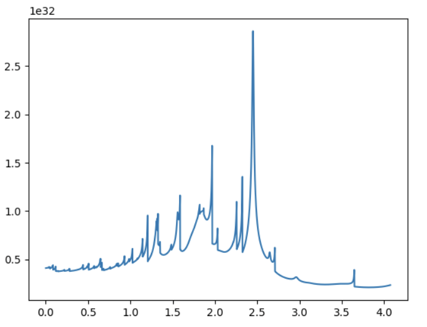
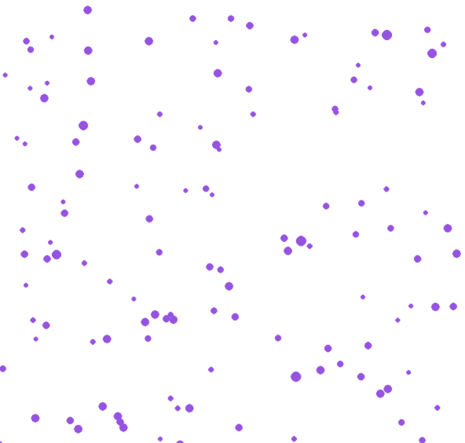

---
# Front matter
lang: ru-RU
title: "Отчёт по четвертому этапу группового проекта"
subtitle: "Образование планетной системы"
author: "Абакумов Егор, Сухарев Кирилл, Калинина Кристина, Еременко Артем"

# Formatting
toc-title: "Содержание"
toc: true # Table of contents
toc_depth: 2
lof: true # List of figures
lot: true # List of tables
fontsize: 12pt
linestretch: 1.5
papersize: a4paper
documentclass: scrreprt
polyglossia-lang: russian
polyglossia-otherlangs: english
mainfont: PT Serif
romanfont: PT Serif
sansfont: PT Sans
monofont: PT Mono
mainfontoptions: Ligatures=TeX
romanfontoptions: Ligatures=TeX
sansfontoptions: Ligatures=TeX,Scale=MatchLowercase
monofontoptions: Scale=MatchLowercase
indent: true
pdf-engine: lualatex
header-includes:
  - \linepenalty=10 # the penalty added to the badness of each line within a paragraph (no associated penalty node) Increasing the value makes tex try to have fewer lines in the paragraph.
  - \interlinepenalty=0 # value of the penalty (node) added after each line of a paragraph.
  - \hyphenpenalty=50 # the penalty for line breaking at an automatically inserted hyphen
  - \exhyphenpenalty=50 # the penalty for line breaking at an explicit hyphen
  - \binoppenalty=700 # the penalty for breaking a line at a binary operator
  - \relpenalty=500 # the penalty for breaking a line at a relation
  - \clubpenalty=150 # extra penalty for breaking after first line of a paragraph
  - \widowpenalty=150 # extra penalty for breaking before last line of a paragraph
  - \displaywidowpenalty=50 # extra penalty for breaking before last line before a display math
  - \brokenpenalty=100 # extra penalty for page breaking after a hyphenated line
  - \predisplaypenalty=10000 # penalty for breaking before a display
  - \postdisplaypenalty=0 # penalty for breaking after a display
  - \floatingpenalty = 20000 # penalty for splitting an insertion (can only be split footnote in standard LaTeX)
  - \raggedbottom # or \flushbottom
  - \usepackage{float} # keep figures where there are in the text
  - \floatplacement{figure}{H} # keep figures where there are in the text
---

# Цель работы

Провести моделирование одного из этапов эволюции Вселенной - образование некой «солнечной» 
системы из межзвездного газа.

## Цель этапа

 Провести коллективное обсуждение результата проекта, подвести итоги работы, сделать выводы.

## Определение значимых для модели свойств объекта

Для всестороннего моделирования планетарной системы нами были выбраны следующие характеристики:

- Положение тел в пространстве

- Масса

- Радиусы

- Скорость

- Ускорение

- Потенциальная энергия

## Механизмы взаимодействия

Движение частиц будет вычисляться согласно II закону Ньютона:

$$F_i = m_i \frac{d^2 r_i}{dt^2}$$ 

Потенциальное энергия взаимодействия частицы со всеми остальными описывается следующим уравнением:

$$U_i=\sum_{i\neq j}\frac{\gamma m_j m_i}{r_{ij}}$$

Сила отталкивания между двумя частицами равна:

$$F^r(b) = k((\frac{a}{b})^8 - 1)$$

А сила трения вычисляется по формуле:

$$F^f = \mu_1\mu_2 F^r(b)$$

## Построение алгоритма

По сути алгоритм сошелся к нахождению векторной суммы всех сил, действующих на частицу, а затем к просчету ее новых координат согласно следующим законам движения:

- Координаты:

$$x_{n+1} = x_n + v_n dt + \frac {a_n dt^2}{2}$$

- Скорости:

$$ v_{n+1} = v_n + \frac {a_{n + 1} + a_n}{2} dt $$

Также необходимо учитывать, что при сильном сближении частицы слипаются. Их параметры в таком случае примут следующий вид.

$$ r = \frac {m_i r_i + m_j r_j}{ m_i + m_j } $$

$$ v = \frac {m_i v_i + m_j v_j}{ m_i + m_j } $$

$$ R = \sqrt[3]{R_i^3 + R_j^3} $$

# Программная реализация

{ #fig:001 width=100% } 

{ #fig:002 width=100% }

{ #fig:003 width=100% }

{ #fig:004 width=100% }

{ #fig:005 width=100% }

{ #fig:006 width=100% }

# Выводы

В ходе работы была разработана и реализована в программном коде модель некой «солнечной» системы из межзвездного газа. Проведены все математические расчеты и подготовлено теоретическое обоснование. 

## Оценка модели

Наш подход продемонстрировал следующие достоинства и недостатки системы:

- + Модель получилась объемной, охватывающей множество частиц

- + Модель учитывает воздействие на частицы всех значимых сил

- + Модель предусматривает слипание частиц и их отталкивание

- + Модель соотносится с реальными условиями, частицы ведут себя естественно

- – Из-за значительной вычислительной сложности пришлось ограничить масштабы модели несколькими сотнями частиц

- – Модель двумерна

- – Константы и коэффициенты взаимодействия некоторых частиц не всегда соотносятся с реальными, так как размер частицы на экране технически ограничен количеством пикселей, невозможно подобрать действительные коэффициенты

# Самооценка

Свою работу наша группа оценивает положительно, так как все основные аспекты моделируемого объекта были учтены, необходимые практические результаты были получены и продемонстрированы. Работа была тщательно проанализирована, ошибки учтены и исправлены, выводы по результатам сделаны, а оставшиеся недостатки обусловлены лишь техническими ограничениями.