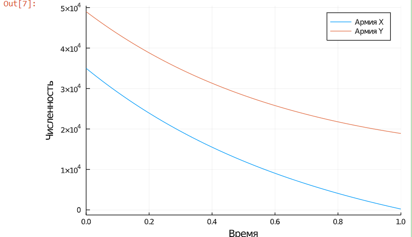
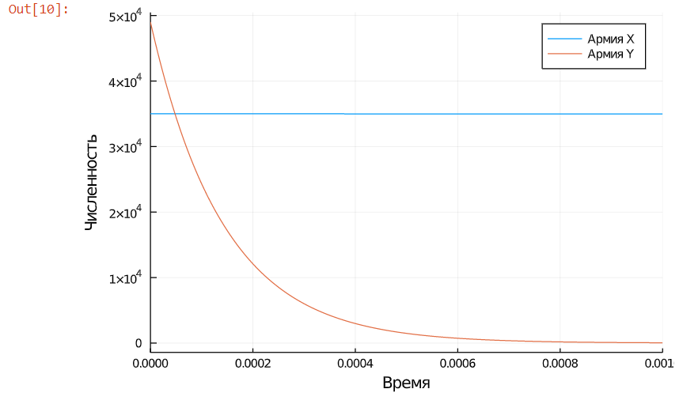

---
## Front matter
lang: ru-RU
title: "Отчет по лабораторной работе 3"
author: |
	Artyom Gennadievich Yeryomenko
institute: |
	RUDN University, Moscow, Russian Federation

## Formatting
toc: false
slide_level: 2
theme: metropolis
header-includes: 
 - \metroset{progressbar=frametitle,sectionpage=progressbar,numbering=fraction}
 - '\makeatletter'
 - '\beamer@ignorenonframefalse'
 - '\makeatother'
aspectratio: 43
section-titles: true
---

# **Цель выполнения лабораторной работы**

## Цель

Построить упрощенную модель боевых действий с помощью Julia.

# **Задачи выполнения лабораторной работы**

## Задание. Вариант 4

Между страной $Х$ и страной $У$ идет война. Численности состава войск исчисляются от начала войны 
и являются временными функциями $x(t)$ и $y(t)$. В начальный момент времени страна $Х$ имеет армию 
численностью 35 000 человек, а в распоряжении страны $У$ армия численностью в 49 000 человек. Для 
упрощения модели считаем, что коэффициенты $a, b, c, h$ постоянны. Также считаем $P(t)$ и $Q(t)$
непрерывными функциями.

Постройте графики изменения численности войск армии $Х$ и армии $У$ для следующих случаев:

1. Модель боевых действий между регулярными войсками
$$\frac{\partial x}{\partial t} = -0,55x(t)-0,9y(t)+2|\sin (t)|$$
$$\frac{\partial y}{\partial t} = -0,8x(t)-0,63y(t)+\cos (13t) + 1$$

2. Модель ведение боевых действий с участием регулярных войск и партизанских отрядов
$$\frac{\partial x}{\partial t} = -0,35x(t)-0,46y(t)+1,5|\sin (2t)|$$
$$\frac{\partial y}{\partial t} = -0,2x(t)y(t)-0,6y(t)+|\cos (0,5t)| + 1$$

# **Результаты выполнения лабораторной работы**

## Динамика изменения численности войск без учёта партизан

{ #fig:001 width=70% }

## Динамика изменения численности войск с учётом партизан

{ #fig:002 width=70% }

## Выводы

Построил упрощенную модель боевых действий с помощью Julia.

В боевых действиях между регулярными войсками победит армия Y, причем ей на это потребуется довольно 
много времени (видим по графику, что численность армии X будет на исходе практический в предельный 
момент времени).

В боевых действиях с участием регулярных войск и партизанских отрядов уже победит армия Х, при чём довольно быстро (видим по графику, что армия Y потеряла всех бойцов практически
сразу после начала войны).
