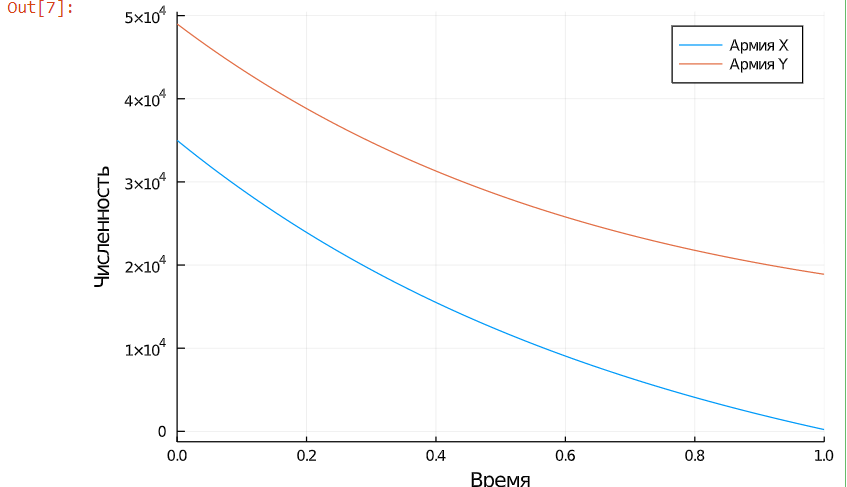
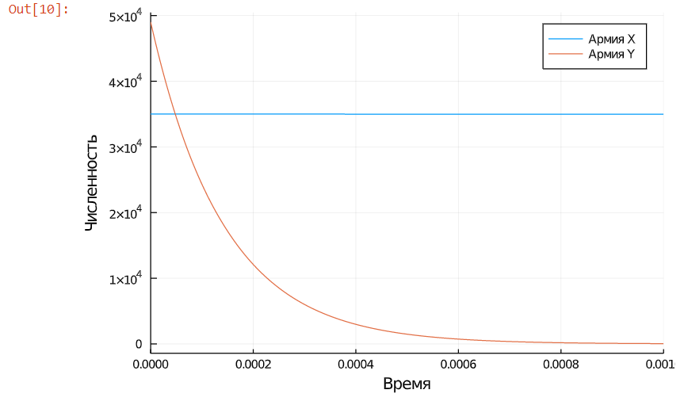

---
# Front matter
lang: ru-RU
title: "Отчёт по лабораторной работе №3"
subtitle: "дисциплина: Математическое моделирование"
author: "Ерёменко Артём Геннадьевич, НПИбд-01-18"

# Formatting
toc-title: "Содержание"
toc: true # Table of contents
toc_depth: 2
lof: true # List of figures
lot: true # List of tables
fontsize: 12pt
linestretch: 1.5
papersize: a4paper
documentclass: scrreprt
polyglossia-lang: russian
polyglossia-otherlangs: english
mainfont: PT Serif
romanfont: PT Serif
sansfont: PT Sans
monofont: PT Mono
mainfontoptions: Ligatures=TeX
romanfontoptions: Ligatures=TeX
sansfontoptions: Ligatures=TeX,Scale=MatchLowercase
monofontoptions: Scale=MatchLowercase
indent: true
pdf-engine: lualatex
header-includes:
  - \linepenalty=10 # the penalty added to the badness of each line within a paragraph (no associated penalty node) Increasing the value makes tex try to have fewer lines in the paragraph.
  - \interlinepenalty=0 # value of the penalty (node) added after each line of a paragraph.
  - \hyphenpenalty=50 # the penalty for line breaking at an automatically inserted hyphen
  - \exhyphenpenalty=50 # the penalty for line breaking at an explicit hyphen
  - \binoppenalty=700 # the penalty for breaking a line at a binary operator
  - \relpenalty=500 # the penalty for breaking a line at a relation
  - \clubpenalty=150 # extra penalty for breaking after first line of a paragraph
  - \widowpenalty=150 # extra penalty for breaking before last line of a paragraph
  - \displaywidowpenalty=50 # extra penalty for breaking before last line before a display math
  - \brokenpenalty=100 # extra penalty for page breaking after a hyphenated line
  - \predisplaypenalty=10000 # penalty for breaking before a display
  - \postdisplaypenalty=0 # penalty for breaking after a display
  - \floatingpenalty = 20000 # penalty for splitting an insertion (can only be split footnote in standard LaTeX)
  - \raggedbottom # or \flushbottom
  - \usepackage{float} # keep figures where there are in the text
  - \floatplacement{figure}{H} # keep figures where there are in the text
---

# Цель работы

Построить упрощенную модель боевых действий с помощью Julia.

# Задание

**Вариант 4**
Между страной $Х$ и страной $У$ идет война. Численности состава войск исчисляются от начала войны 
и являются временными функциями $x(t)$ и $y(t)$. В начальный момент времени страна $Х$ имеет армию 
численностью 35 000 человек, а в распоряжении страны $У$ армия численностью в 49 000 человек. Для 
упрощения модели считаем, что коэффициенты $a, b, c, h$ постоянны. Также считаем $P(t)$ и $Q(t)$
непрерывными функциями.

Постройте графики изменения численности войск армии $Х$ и армии $У$ для следующих случаев:

1. Модель боевых действий между регулярными войсками
$$\frac{\partial x}{\partial t} = -0,55x(t)-0,9y(t)+2|\sin (t)|$$
$$\frac{\partial y}{\partial t} = -0,8x(t)-0,63y(t)+\cos (13t) + 1$$

2. Модель ведение боевых действий с участием регулярных войск и партизанских отрядов
$$\frac{\partial x}{\partial t} = -0,35x(t)-0,46y(t)+1,5|\sin (2t)|$$
$$\frac{\partial y}{\partial t} = -0,2x(t)y(t)-0,6y(t)+|\cos (0,5t)| + 1$$

# Выполнение лабораторной работы

**1. Боевые действия между регулярными войсками**

1.1. Изучил начальные условия. Коэффициент смертности, не связанный с боевыми действиями, у первой
армии 0,55, а у второй -- 0,63. Коэффициент эффективности первой и второй армии 0,9 и 
0,8 соответственно.  Функция, описывающая подход подкрепление первой армии, $P(t) = 2|\sin (t)|$, 
подкрепление второй армии описывается функцией $Q(t) = \cos (13t) + 1$. $x_{0} = 35000$ -- численность
1-ой армии, $y_{0} = 49000$ -- численность 2-ой армии.

1.2. Оформил начальные условия в код на Julia:
```
x0 = 35000 #численность первой армии
y0 = 49000 #численность второй армии

a = 0.55 #константа, характеризующая степень влияния различных факторов на потери
b = 0.9 #эффективность боевых действий армии у
c = 0.8 #эффективность боевых действий армии х
h = 0.63 #константа, характеризующая степень влияния различных факторов на потери
par = [a,b,c,h] #массив коэффициентов

function P(t)  #возможность подхода подкрепления к армии х
    return (2*abs(sin(t)))
end

function Q(t)  #возможность подхода подкрепления к армии у
    return (cos(13*t) + 1)
end
```

1.3. Для времени задал следующие условия: $t_{0} = 0$ -- начальный момент времени, $t_{max} = 1$ --
предельный момент времени.

1.4. Добавил в программу условия, описывающие время:
```
t0 = 0.0 #начальный момент времени
tmax = 1.0 #предельный момент времени
t = (t0,tmax)
```

1.5. Запрограммировал заданную систему дифференциальных уравнений, описывающих изменение численности
армий:
```
#Система дифференциальных уравнений
function NO_PARTIZANS(du,u,p,t)
  a,b,c,h = p
  y1,y2 = u
  du[1] = - a.*y1 - b*y2 + P(t) #изменение численности первой армии
  du[2] = - c.*y1 - h*y2 + Q(t) #изменение численности второй армии
end
```

1.6. Создал вектор начальной численности армий:
```
v0 = [x0,y0] #Вектор начальных условий
```

1.7. Запрограммировал решение системы уравнений:
```
prob = ODEProblem(NO_PARTIZANS,v0,t,par)
sol = solve(prob)

```

1.8. Описал построение графика изменения численности армий:
```
#Построение графиков решений
plot(sol,xlabel = "Время", title = "Регулярные войска", label = ["Страна X" "Страна Y"])
```

**2. Боевые действия с участием регулярных войск и партизанских отрядов**

2.1. Изучил начальные условия. Коэффициент смертности, не связанный с боевыми действиями, у первой
армии 0,35, а у второй -- 0,6. Коэффициент эффективности первой и второй армии 0,46 и 
0,2 соответственно.  Функция, описывающая подход подкрепление первой армии, $P(t) = 1,5|\sin (2t)|$, 
подкрепление второй армии описывается функцией $Q(t) = |\cos (0,5t)|+1$. Изначальная численность армий 
такая же, как и в п. 1.1.

2.2. Дополнил начальные условия в коде на Python:
```
a_p = 0.35 #константа, характеризующая степень влияния различных факторов на потери
b_p = 0.46 #эффективность боевых действий армии у
c_p = 0.2 #эффективность боевых действий армии х
h_p = 0.6 #константа, характеризующая степень влияния различных факторов на потери
par_p = [a_p,b_p,c_p,h_p] #массив коэффициентов

function P_p(t)  #возможность подхода подкрепления к армии х
    return (1.5*abs(sin(2*t)))
end

function Q_p(t)  #возможность подхода подкрепления к армии у
    return (cos(0.5*t) + 1)
end
```

2.3. Условия для времени оставил такие же, как и в п. 1.3, соответственно, не дублировал их в 
программе.

2.4. Запрограммировал заданную систему дифференциальных уравнений, описывающих изменение численности
армий:
```
#Система дифференциальных уравнений
function PARTIZANS(du,u,p,t)
  a,b,c,h = p
  y1,y2 = u
  du[1] = - a*y1 - b*y2 + P_p(t) #изменение численности первой армии
  du[2] = - c*y1*y2 - h*y2 + Q_p(t) #изменение численности второй армии
end
```

2.5. Т. к. начальная численность армий не изменилась, вектор начальных условий тоже не менял.

2.6. Запрограммировал решение системы уравнений:
```
#Решение системы
prob_p = ODEProblem(PARTIZANS,v0,(0.0,0.001),par_p)
sol_p = solve(prob_p)
```

2.7. Описал построение графика изменения численности армий:
```
#Построение графиков решений
plot(sol_p, title = "Регулярные войска + партизаны", label = ["Страна X" "Страна Y"])
```

**3. Сборка программы**

3.1. Собрал код программы воедино и получила следующий код:
```
using DifferentialEquations, Plots

x0 = 35000 #численность первой армии
y0 = 49000 #численность второй армии

a = 0.55 #константа, характеризующая степень влияния различных факторов на потери
b = 0.9 #эффективность боевых действий армии у
c = 0.8 #эффективность боевых действий армии х
h = 0.63 #константа, характеризующая степень влияния различных факторов на потери
par = [a,b,c,h] #массив коэффициентов

function P(t)  #возможность подхода подкрепления к армии х
    return (2*abs(sin(t)))
end

function Q(t)  #возможность подхода подкрепления к армии у
    return (cos(13*t) + 1)
end

t0 = 0.0 #начальный момент времени
tmax = 1.0 #предельный момент времени
t = (t0,tmax)

#Система дифференциальных уравнений
function NO_PARTIZANS(du,u,p,t)
  a,b,c,h = p
  y1,y2 = u
  du[1] = - a.*y1 - b*y2 + P(t) #изменение численности первой армии
  du[2] = - c.*y1 - h*y2 + Q(t) #изменение численности второй армии
end

v0 = [x0,y0] #Вектор начальных условий

#Решение системы
prob = ODEProblem(NO_PARTIZANS,v0,t,par)
sol = solve(prob)

#Построение графиков решений
plot(sol,xlabel = "Время", title = "Регулярные войска", label = ["Страна X" "Страна Y"])
```
```
a_p = 0.35 #константа, характеризующая степень влияния различных факторов на потери
b_p = 0.46 #эффективность боевых действий армии у
c_p = 0.2 #эффективность боевых действий армии х
h_p = 0.6 #константа, характеризующая степень влияния различных факторов на потери
par_p = [a_p,b_p,c_p,h_p] #массив коэффициентов

function P_p(t)  #возможность подхода подкрепления к армии х
    return (1.5*abs(sin(2*t)))
end

function Q_p(t)  #возможность подхода подкрепления к армии у
    return (cos(0.5*t) + 1)
end
#Система дифференциальных уравнений
function PARTIZANS(du,u,p,t)
  a,b,c,h = p
  y1,y2 = u
  du[1] = - a*y1 - b*y2 + P_p(t) #изменение численности первой армии
  du[2] = - c*y1*y2 - h*y2 + Q_p(t) #изменение численности второй армии
end

#Решение системы
prob_p = ODEProblem(PARTIZANS,v0,(0.0,0.001),par_p)
sol_p = solve(prob_p)
#Построение графиков решений
plot(sol_p, title = "Регулярные войска + партизаны", label = ["Страна X" "Страна Y"])
```

3.2. Получил графики изменения численностей армий (см. рис. -@fig:001 и -@fig:002):

{ #fig:001 width=70% }

{ #fig:002 width=70% }

# Выводы

Построил упрощенную модель боевых действий с помощью Julia.

В боевых действиях между регулярными войсками победит армия Y, причем ей на это потребуется довольно 
много времени (видим по графику, что численность армии X будет на исходе практический в предельный 
момент времени).

В боевых действиях с участием регулярных войск и партизанских отрядов уже победит армия Х, при чём довольно быстро (видим по графику, что армия Y потеряла всех бойцов практически
сразу после начала войны).
