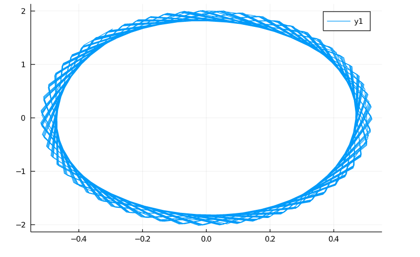
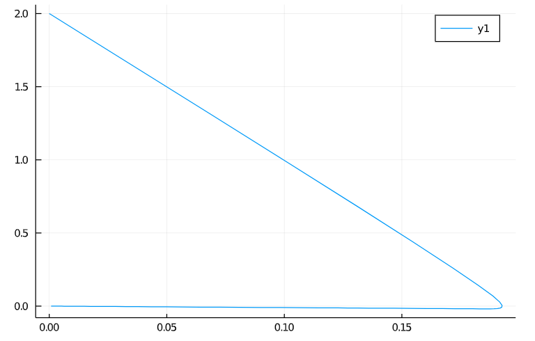
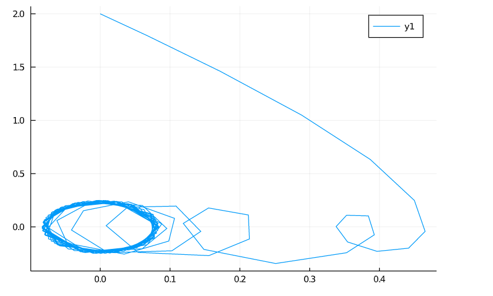

---
# Front matter
lang: ru-RU
title: "Отчёт по лабораторной работе №4"
subtitle: "дисциплина: Математическое моделирование"
author: "Ерёменко Артём Геннадьевич, НПИбд-02-18"

# Formatting
toc-title: "Содержание"
toc: true # Table of contents
toc_depth: 2
lof: true # List of figures
lot: true # List of tables
fontsize: 12pt
linestretch: 1.5
papersize: a4paper
documentclass: scrreprt
polyglossia-lang: russian
polyglossia-otherlangs: english
mainfont: PT Serif
romanfont: PT Serif
sansfont: PT Sans
monofont: PT Mono
mainfontoptions: Ligatures=TeX
romanfontoptions: Ligatures=TeX
sansfontoptions: Ligatures=TeX,Scale=MatchLowercase
monofontoptions: Scale=MatchLowercase
indent: true
pdf-engine: lualatex
header-includes:
  - \linepenalty=10 # the penalty added to the badness of each line within a paragraph (no associated penalty node) Increasing the value makes tex try to have fewer lines in the paragraph.
  - \interlinepenalty=0 # value of the penalty (node) added after each line of a paragraph.
  - \hyphenpenalty=50 # the penalty for line breaking at an automatically inserted hyphen
  - \exhyphenpenalty=50 # the penalty for line breaking at an explicit hyphen
  - \binoppenalty=700 # the penalty for breaking a line at a binary operator
  - \relpenalty=500 # the penalty for breaking a line at a relation
  - \clubpenalty=150 # extra penalty for breaking after first line of a paragraph
  - \widowpenalty=150 # extra penalty for breaking before last line of a paragraph
  - \displaywidowpenalty=50 # extra penalty for breaking before last line before a display math
  - \brokenpenalty=100 # extra penalty for page breaking after a hyphenated line
  - \predisplaypenalty=10000 # penalty for breaking before a display
  - \postdisplaypenalty=0 # penalty for breaking after a display
  - \floatingpenalty = 20000 # penalty for splitting an insertion (can only be split footnote in standard LaTeX)
  - \raggedbottom # or \flushbottom
  - \usepackage{float} # keep figures where there are in the text
  - \floatplacement{figure}{H} # keep figures where there are in the text
---

# Цель работы

Построить модель гармонических колебаний с помощью Julia.

# Задание

**Вариант 4**
Постройте фазовый портрет гармонического осциллятора и решение уравнения гармонического осциллятора для следующих случаев:

1. Колебания гармонического осциллятора без затуханий и без действий внешней силы $\ddot {x} + 15x = 0$

2. Колебания гармонического осциллятора c затуханием и без действий внешней силы $\ddot {x} + 10 \dot {x} + x = 0$

3. Колебания гармонического осциллятора c затуханием и под действием внешней силы $\ddot {x} + 3 \dot {x} + x =  \sin (3t)$

На интервале $t \in [0; 55]$ (шаг 0,05) с начальными условиями $x_0 = 0, y_0 = 2$

# Выполнение лабораторной работы

**1. Колебания без затуханий и без действий внешней силы**

1.1. Уравнение свободных колебаний гармонического осциллятора имеет следующий вид:
$$ \ddot {x} + 2 \gamma \dot {x} + \omega _0^2x = f(t) $$

Изучил начальные условия. Первая формула - это уравнение осциллятора, при котором в системе нет потерь  
, поэтому, $\gamma = 0$. Частота колебаний $\omega = \sqrt {15}$. $x_{0} = 0, y_{0} = 2$. Правая часть уравнения $f(t) = 0$.

1.2. Ввёл начальные условия в код на Julia:
```
w1 = 15^0.5
g1 = 0*0.5

par1 = [w1,g1]

x0 = [0.0,2.0]

```

1.3. Решение ищу на интервале $t \in [0; 55]$ (шаг не получается задать, так как в ODEProblem(prob, v0, t, p) t обязательно должно быть парой (t0,tmax)), значит, $t_{0} = 0$ -- начальный момент времени, $t_{max} = 55$ -- предельный момент времени.

1.4. Добавил в программу условия, описывающие время:
```
t0 = 0.0
tmax = 55.0

t = (t0,tmax)
```

1.5. Представил заданное уравнение второго порядка в виде системы двух уравнений первого порядка: 
```
function dx1(dv,v,p,t)
    w,g = p
    x1,x2 = v
    dv[1] = x2;
    dv[2] = -w.* w.* x1;
end
```

1.6.  Поместил начальные условия в решатель системы уравнений:
```
x1 = ODEProblem(dx1,x0,t,par1)
sol1 = solve(x1)
```

1.7. Переписал отдельно $x$ в $y11$, а $\dot {x}$ в $y21$:
```
n1 = size(sol1,2)

y11 = Array{Float16}(undef, n1)
y21 = Array{Float16}(undef, n1)
for i = 1: n1
    y11[i] = sol1[1, i]
    y21[i] = sol1[2, i]
end
```

1.8. Построил фазовый портрет:
```
plot(y11,y21)
```

**2. Колебания c затуханием и без действий внешней силы**

2.1. Изучила начальные условия. $\gamma = 5$ - потеря энергии. Собственная частота колебаний $\omega = \sqrt {1}$. $x_{0}$ и $y_{0}$ остались такими же. 
Правая часть уравнения такая же, как и в п. 1.1.

2.2. Начальные значения переменных одинаковы для всех пунктов задачи. Остальные начальные условия оформил в код на Julia:
```
w2 = 1^0.5
g2 = 10*0.5

par2 = [w2,g2]
```

2.3. Интервал решения такой же.

2.4. Представил заданное уравнение второго порядка в виде системы двух уравнений первого порядка: 
```
function dx2(dv,v,p,t)
    w,g = p
    x1,x2 = v
    dv[1] = x2;
    dv[2] = -w.* w.* x1 - 2*g.* x2 ;
end
```

2.5.  Поместил начальные условия в решатель системы уравнений:
```
x2 = ODEProblem(dx2,x0,t,par2)
sol2 = solve(x2)
```

2.6. Переписал отдельно $x$ в $y11$, а $\dot {x}$ в $y21$:
```
n2 = size(sol2,2)

y12 = Array{Float16}(undef, n1)
y22 = Array{Float16}(undef, n1)
for i = 1: n2
    y12[i] = sol2[1, i]
    y22[i] = sol2[2, i]
end
```

2.7. Построил фазовый портрет:
```
plot(y12,y22)
```

**3. Колебания c затуханием и под действием внешней силы**

3.1. Изучила начальные условия. $\gamma = 1.5$ - потеря энергии. Собственная частота колебаний $\omega = \sqrt {1}$. $x_{0}$ и $y_{0}$ остались такими же. 
Правая часть уравнения $f(t) = \sin (3t)$.

2.2. Начальные значения переменных одинаковы для всех пунктов задачи. Остальные начальные условия оформил в код на Julia:
```
w3 = 1^0.5
g3 = 3*0.5

par3 = [w3,g3]

function f(t)
    return sin(3 * t)
end
```

2.3. Интервал решения такой же.

2.4. Представил заданное уравнение второго порядка в виде системы двух уравнений первого порядка: 
```
function dx3(dv,v,p,t)
    w,g = p
    x1,x2 = v
    dv[1] = x2;
    dv[2] = -w.* w.* x1 - 2*g.* x2 - f(t);
end
```

2.5.  Поместил начальные условия в решатель системы уравнений:
```
x3 = ODEProblem(dx3,x0,t,par3)
sol3 = solve(x3)
```

2.6. Переписал отдельно $x$ в $y11$, а $\dot {x}$ в $y21$:
```
n3 = size(sol3,2)

y13 = Array{Float16}(undef, n1)
y23 = Array{Float16}(undef, n1)
for i = 1: n2
    y13[i] = sol3[1, i]
    y23[i] = sol3[2, i]
end
```

2.7. Построил фазовый портрет:
```
plot(y13,y23)
```

**4. Сборка программы**

4.1. Код целиком:
```
using DifferentialEquations, Plots 
#Параметры осциллятора
#x'' + 2*g* x' + w^2* x = f(t)
#w - частота
#g - затухание
w1 = 15^0.5
g1 = 0*0.5

w2 = 1^0.5
g2 = 10*0.5

w3 = 1^0.5
g3 = 3*0.5


#Правая часть уравнения f(t)
function f(t)
    return sin(3 * t)
end
#/Вектор-функция f(t, x)
#/для решения системы дифференциальных уравнений
#/x' = y(t, x)
#/где x - искомый вектор
function dx1(dv,v,p,t)
    w,g = p
    x1,x2 = v
    dv[1] = x2;
    dv[2] = -w.* w.* x1;
end
function dx2(dv,v,p,t)
    w,g = p
    x1,x2 = v
    dv[1] = x2;
    dv[2] = -w.* w.* x1 - 2*g.* x2 ;
end
function dx3(dv,v,p,t)
    w,g = p
    x1,x2 = v
    dv[1] = x2;
    dv[2] = -w.* w.* x1 - 2*g.* x2 - f(t);
end
#Точка, в которой заданы
#начальные условия
par1 = [w1,g1]
par2 = [w2,g2]
par3 = [w3,g3]

t0 = 0.0
tmax = 55.0
#Вектор начальных условий
#x(t0) = x0
x0 = [0.0,2.0]
#Интервал на котором будет
#решаться задача
t = (t0,tmax)
#Решаем дифференциальные уравнения
#с начальным условием x(t0) = x0
#на интервале t
#с правой частью, заданной y
#и записываем решение в матрицу x
x1 = ODEProblem(dx1,x0,t,par1)
sol1 = solve(x1)
#Количество столбцов в матрице
n1 = size(sol1,2)
#Переписываем отдельно
#x в y1, x' в y2
y11 = Array{Float16}(undef, n1)
y21 = Array{Float16}(undef, n1)
for i = 1: n1
    y11[i] = sol1[1, i]
    y21[i] = sol1[2, i]
end
#Рисуем фазовый портрет: зависимость x(x')

plot(y11,y21)
```

```
x2 = ODEProblem(dx2,x0,t,par2)
sol2 = solve(x2)
#Количество столбцов в матрице
n2 = size(sol2,2)
#Переписываем отдельно
#x в y1, x' в y2
y12 = Array{Float16}(undef, n2)
y22 = Array{Float16}(undef, n2)
for i = 1: n2
    y12[i] = sol2[1, i]
    y22[i] = sol2[2, i]
end
#Рисуем фазовый портрет: зависимость x(x')

plot(y12,y22)
```

```
x3 = ODEProblem(dx3,x0,t,par3)
sol3 = solve(x3)
#Количество столбцов в матрице
n3 = size(sol3,2)
#Переписываем отдельно
#x в y1, x' в y2
y13 = Array{Float16}(undef, n3)
y23 = Array{Float16}(undef, n3)
for i = 1: n3
    y13[i] = sol3[1, i]
    y23[i] = sol3[2, i]
end
#Рисуем фазовый портрет: зависимость x(x')

plot(y13,y23)
```

4.2. Получил фазовые портреты гармонического осциллятора (см. рис. -@fig:001, -@fig:002 и -@fig:003):

{ #fig:001 width=70% }

{ #fig:002 width=70% }

{ #fig:003 width=70% }

# Выводы

Построил модель гармонических колебаний с помощью Julia.

# Ответы на вопросы к лабораторной работе

*1. Запишите простейшую модель гармонических колебаний*

$$ \ddot {x} + \omega _0^2x = 0 $$ 

*2. Дайте определение осциллятора*

Осциллятор — система, совершающая периодичные колебания.

*3. Запишите модель математического маятника*
 
$$\frac{\partial ^2 \alpha}{\partial t^2} + \frac{g}{L} sin{\alpha} = 0$$ 


*4. Запишите алгоритм перехода от дифференциального уравнения второго порядка к двум дифференциальным уравнениям первого порядка*

От дифференциального уравнение 2-го порядка:
$$ \ddot {x} + \omega _0^2x = 0 $$

Делаем замену:
$$ y = \dot{x} $$

Получаем систему уравнений:

$$ y = \dot{x} $$

$$ \dot{y} = - \omega _0^2x $$
    

*5. Что такое фазовый портрет и фазовая траектория?*

Фазовый портрет —  зависимость величин друг от друга. Эти величины также описывают состояние системы.

Фазовая траектория — график нарисованный точками состояний.