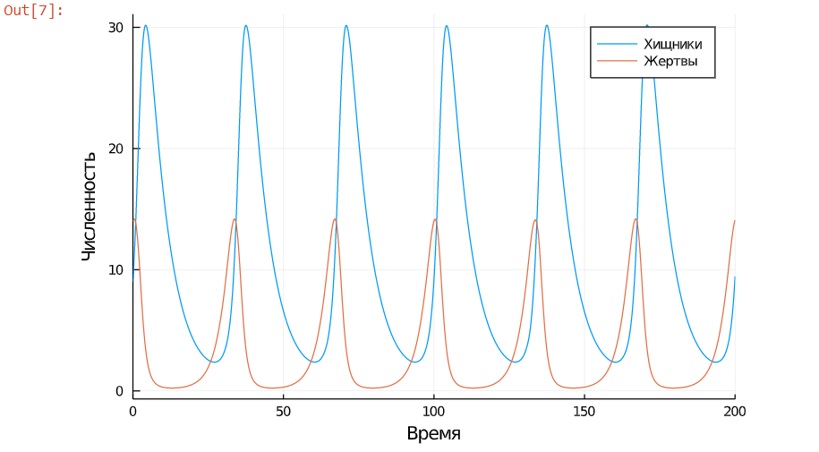
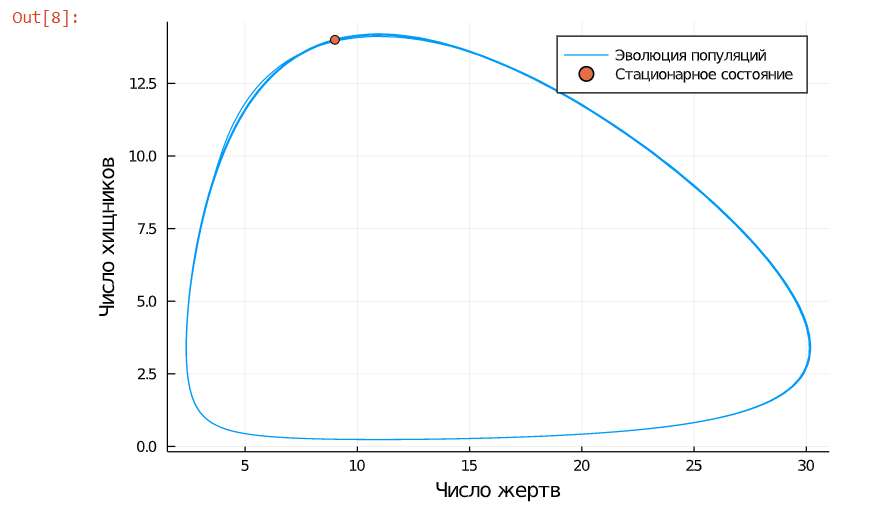

---
## Front matter
lang: ru-RU
title: "Отчет по лабораторной работе 5"
author: |
	Artyom Gennadievich Yeryomenko
institute: |
	RUDN University, Moscow, Russian Federation

## Formatting
toc: false
slide_level: 2
theme: metropolis
header-includes: 
 - \metroset{progressbar=frametitle,sectionpage=progressbar,numbering=fraction}
 - '\makeatletter'
 - '\beamer@ignorenonframefalse'
 - '\makeatother'
aspectratio: 43
section-titles: true
---

# **Цель выполнения лабораторной работы**

## Цель

Построить модель Лотки-Вольтерры типа "хищник -- жертва" с помощью Julia.

# **Задачи выполнения лабораторной работы**

## Задание. Вариант 4

Для модели «хищник-жертва»:

$$
\begin{cases}
    \frac{\partial x}{\partial t} = -0.15x(t)+0.044x(t)y(t)
    \\
    \frac{\partial y}{\partial t} = 0.35y(t)-0.032x(t)y(t)
\end{cases}
$$

Постройте график зависимости численности хищников от численности жертв, а также графики изменения численности хищников и численности жертв при следующих 
начальных условиях: $x_0 = 9, y_0 = 14$. Найдите стационарное состояние системы.

# **Результаты выполнения лабораторной работы**

## График колебаний изменения числа популяции хищников и жертв

{ #fig:001 width=70% } 

## График зависимости изменения численности хищников от изменения численности жертв

{ #fig:002 width=70% }

## Выводы

Построил модель Лотки-Вольтерры типа "хищник -- жертва" с помощью Julia.