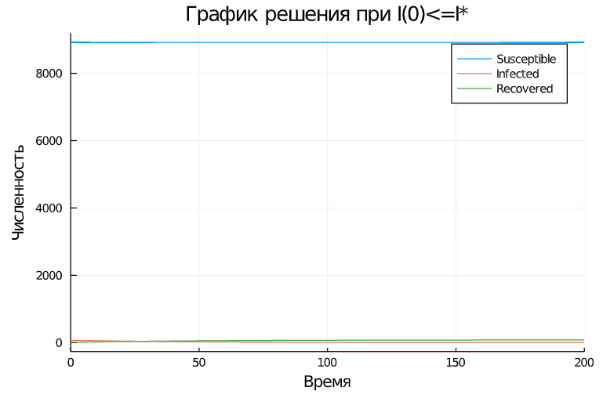
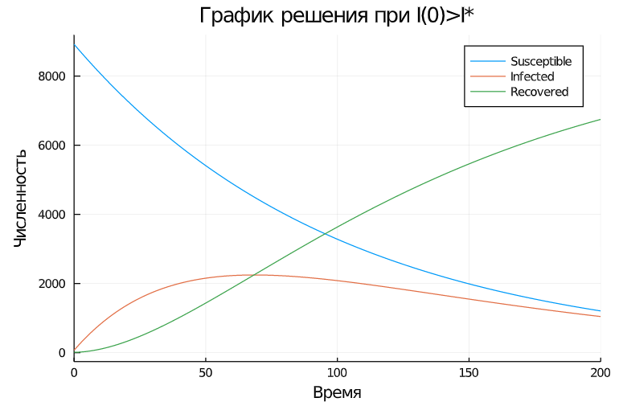

---
# Front matter
lang: ru-RU
title: "Отчёт по лабораторной работе №6"
subtitle: "дисциплина: Математическое моделирование"
author: "Ерёменко Артём Геннадьевич, НПИбд-02-18"

# Formatting
toc-title: "Содержание"
toc: true # Table of contents
toc_depth: 2
lof: true # List of figures
lot: true # List of tables
fontsize: 12pt
linestretch: 1.5
papersize: a4paper
documentclass: scrreprt
polyglossia-lang: russian
polyglossia-otherlangs: english
mainfont: PT Serif
romanfont: PT Serif
sansfont: PT Sans
monofont: PT Mono
mainfontoptions: Ligatures=TeX
romanfontoptions: Ligatures=TeX
sansfontoptions: Ligatures=TeX,Scale=MatchLowercase
monofontoptions: Scale=MatchLowercase
indent: true
pdf-engine: lualatex
header-includes:
  - \linepenalty=10 # the penalty added to the badness of each line within a paragraph (no associated penalty node) Increasing the value makes tex try to have fewer lines in the paragraph.
  - \interlinepenalty=0 # value of the penalty (node) added after each line of a paragraph.
  - \hyphenpenalty=50 # the penalty for line breaking at an automatically inserted hyphen
  - \exhyphenpenalty=50 # the penalty for line breaking at an explicit hyphen
  - \binoppenalty=700 # the penalty for breaking a line at a binary operator
  - \relpenalty=500 # the penalty for breaking a line at a relation
  - \clubpenalty=150 # extra penalty for breaking after first line of a paragraph
  - \widowpenalty=150 # extra penalty for breaking before last line of a paragraph
  - \displaywidowpenalty=50 # extra penalty for breaking before last line before a display math
  - \brokenpenalty=100 # extra penalty for page breaking after a hyphenated line
  - \predisplaypenalty=10000 # penalty for breaking before a display
  - \postdisplaypenalty=0 # penalty for breaking after a display
  - \floatingpenalty = 20000 # penalty for splitting an insertion (can only be split footnote in standard LaTeX)
  - \raggedbottom # or \flushbottom
  - \usepackage{float} # keep figures where there are in the text
  - \floatplacement{figure}{H} # keep figures where there are in the text
---

# Цель работы

Построить простейшую модель эпидемии с помощью Julia.

# Задание

**Вариант 4**

На одном острове вспыхнула эпидемия. Известно, что из всех проживающих на острове ($N = 9000$) в момент начала эпидемии ($t = 0$) число заболевших людей
(являющихся распространителями инфекции) $I(0) = 70$, а число здоровых людей с иммунитетом к болезни $R(0) = 10$. Таким образом, число людей восприимчивых к
болезни, но пока здоровых, в начальный момент времени $S(0) = N - I(0) - R(0)$.

Постройте графики изменения числа особей в каждой из трех групп.
Рассмотрите, как будет протекать эпидемия в случае:

1) если $I(0) \leq I^*$

2) если $I(0) > I^*$

# Теоретическое введение

Предположим, что некая популяция, состоящая из N особей, (считаем, что популяция изолирована) подразделяется на три группы:

- $S(t)$ — восприимчивые к болезни, но пока здоровые особи;

- $I(t)$ — это число инфицированных особей, которые также при этом являются распространителями инфекции;

- $R(t)$ — это здоровые особи с иммунитетом к болезни. 

До того, как число заболевших не превышает критического значения $I^*$ считаем, что все больные изолированы и не заражают здоровых. Когда $I(t) > I^*$, тогда 
инфицирование способны заражать восприимчивых к болезни особей.

Таким образом, скорость изменения числа S(t) меняется по следующему закону:

$$ \frac{\partial S}{\partial t} = \begin{cases} - \alpha S, если I(t)>I^* \\ 0, если I(t) \leq I^* \end{cases}$$

Поскольку каждая восприимчивая к болезни особь, которая в конце концов заболевает, сама становится инфекционной, то скорость изменения числа инфекционных 
особей представляет разность за единицу времени между заразившимися и теми, кто уже болеет и лечится, т.е.:

$$ \frac{\partial I}{\partial t} = \begin{cases} - \alpha S - \beta I, если I(t)>I^* \\ - \beta I, если I(t) \leq I^* \end{cases}$$

А скорость изменения выздоравливающих особей (при этом приобретающие иммунитет к болезни):

$$ \frac{\partial R}{\partial t} = \beta I$$

Постоянные пропорциональности:

- $\alpha$ — коэффициент заболеваемости

- $\beta$ — коэффициент выздоровления

Для того, чтобы решения соответствующих уравнений определялись однозначно, необходимо задать начальные условия. Считаем, что на начало эпидемии в момент 
времени $t = 0$ нет особей с иммунитетом к болезни $R(0) = 0$, а число инфицированных и восприимчивых к болезни особей $I(0)$ и $S(0)$ соответственно. 
Для анализа картины протекания эпидемии необходимо рассмотреть два случая: $I(0) \leq I^*$ и $I(0) > I^*$.

# Выполнение лабораторной работы

1. Изучил начальные условия. Популяция состоит из 9000 особей. В начальный момент времени: 70 особей инфицированы; 10 здоровых особей с иммунитетом; 
(9000 - 70 - 10) особей, воприимчивых к болезни. Задала коэффициент заболеваемости, равный 0,01, и коэффициент выздоровления, равный 0,02.

2. Оформил начальные условия в код на Julia:
```
N = 9000 #численность населения
I0 = 70 #начальная численность инфицированных индивидов
R0 = 10 #начальная численность переболевших индивидов
S0 = N - I0 - R0 #начальная численность восприимчивых индивидов

u0 = [S0,I0, R0] #Вектор начальных условий

a = 0.01 #коэффициент интенсивности контактов индивидов с последующим инфицированием
b = 0.02 # коэффициент интенсивности выздоровления инфицированных индивидов
```

3. Задал условия для времени: $t_{0} = 0$ -- начальный момент времени, $t_{max} = 200$ -- предельный момент времени, $dt = 0,01$ -- шаг изменения времени.

4. Добавил в программу условия, описывающие время:
```
t0 = 0.0 #начальный момент времени
tmax = 200.0 #предельный момент времени
dt = 0.01
t = (t0,tmax)
```

5. Запрограммировал систему уравнений, соответствующую 1-ому случаю ($I(0) \leq I^*$): 
```
function model1(du,u,p,t)
  a,b = p
  u1,u2,u3 = u
  du[1] = 0 #изменение численности восприимчивых индивидов во времени 
  du[2] = -b*u2 #изменение численности инфицированных индивидов во времени 
  du[3] = b*u2 #изменение численности переболевших индивидов во времени
end
```

6. Запрограммировал систему уравнений, соответствующую 2-ому случаю ($I(0) > I^*$): 
```
function model2(du,u,p,t)
  a,b = p
  u1,u2,u3 = u
  du[1] = -a*u1 #изменение численности восприимчивых индивидов во времени 
  du[2] = a*u1-b*u2 #изменение численности инфицированных индивидов во времени 
  du[3] = b*u2 #изменение численности переболевших индивидов во времени
end
```

7. Запрограммировал решение систем уравнений:
```
sol1 = solve(ODEProblem(model1, u0, t, par), saveat = dt)
sol2 = solve(ODEProblem(model2, u0, t, par), saveat = dt)
```

8. Описал построение графика для 1-ого случая ($I(0) \leq I^*$):
```
plot(sol1,xlabel = "Время",ylabel = "Численность", title = "График решения при I(0)<=I*", label = ["Susceptible" "Infected" "Recovered"])
```

9. Описал построение графика для 2-ого случая ($I(0) > I^*$):
```
plot(sol2,xlabel = "Время",ylabel = "Численность", title = "График решения при I(0)>I*", label = ["Susceptible" "Infected" "Recovered"])
```

10. Собрал код программы воедино и получил следующее:
```
using DifferentialEquations, Plots

N = 9000 #численность населения
I0 = 70 #начальная численность инфицированных индивидов
R0 = 10 #начальная численность переболевших индивидов
S0 = N - I0 - R0 #начальная численность восприимчивых индивидов

u0 = [S0,I0, R0] #Вектор начальных условий

a = 0.01 #коэффициент интенсивности контактов индивидов с последующим инфицированием
b = 0.02 # коэффициент интенсивности выздоровления инфицированных индивидов

t0 = 0.0 #начальный момент времени
tmax = 200.0 #предельный момент времени
dt = 0.01
t = (t0,tmax)

function model1(du,u,p,t)
  a,b = p
  u1,u2,u3 = u
  du[1] = 0 #изменение численности восприимчивых индивидов во времени 
  du[2] = -b*u2 #изменение численности инфицированных индивидов во времени 
  du[3] = b*u2 #изменение численности переболевших индивидов во времени
end


par = [a,b] #массив коэффициентов

#Решение системы
sol1 = solve(ODEProblem(model1, u0, t, par), saveat = dt)

#Построение графиков решений
plot(sol1,xlabel = "Время",ylabel = "Численность", title = "График решения при I(0)<=I*", label = ["Susceptible" "Infected" "Recovered"])
```

```
function model2(du,u,p,t)
  a,b = p
  u1,u2,u3 = u
  du[1] = -a*u1 #изменение численности восприимчивых индивидов во времени 
  du[2] = a*u1-b*u2 #изменение численности инфицированных индивидов во времени 
  du[3] = b*u2 #изменение численности переболевших индивидов во времени
end

#Решение системы
sol2 = solve(ODEProblem(model2, u0, t, par), saveat = dt)

#Построение графиков решений
plot(sol2,xlabel = "Время",ylabel = "Численность", title = "График решения при I(0)>I*", label = ["Susceptible" "Infected" "Recovered"])
```

11. Получил следующие динамики изменения числа людей из каждой группы (см. рис. -@fig:001 и -@fig:002):

{ #fig:001 width=70% }

{ #fig:002 width=70% }

# Выводы

Построил простейшую модель эпидемии с помощью Julia.

В обоих случаях люди острова смогут победить болезнь.